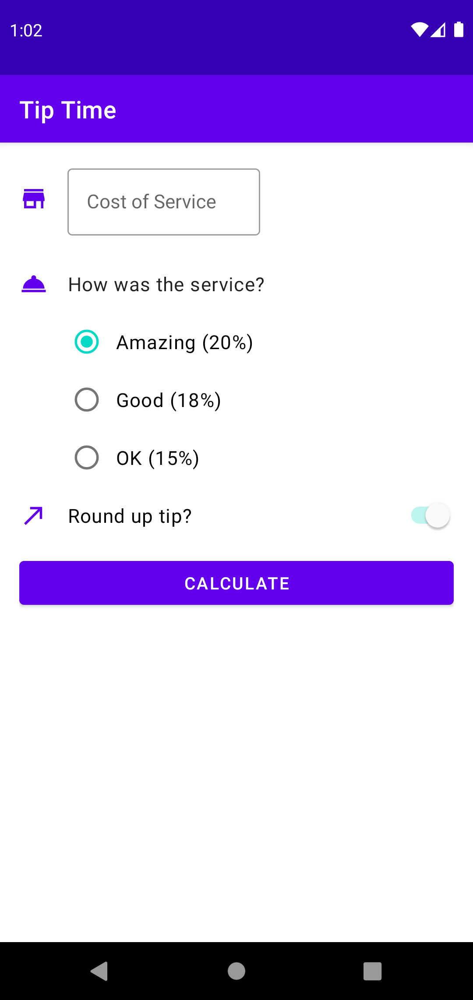
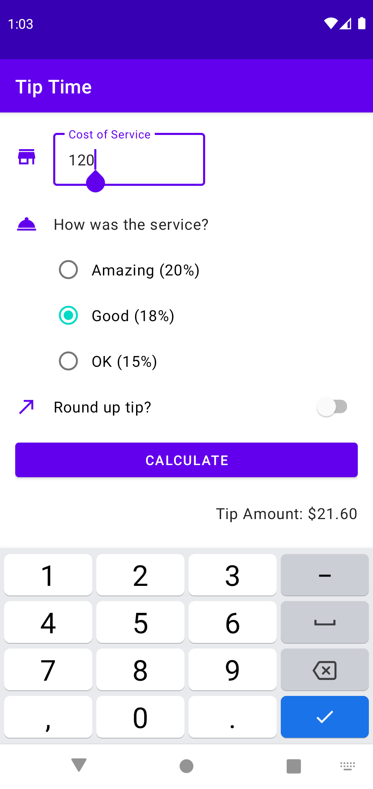

# Tip Calculator

A tip calculator app made in Android Basics in Kotlin course

## Introduction

The Tip Calculator app contains various UI elements for calculating a tip, teaching about app structure, user input, and view binding.

## Some Images

 

## Getting Started

1. Download the project.
2. Import the project into Android Studio.
3. Build and run the project.
